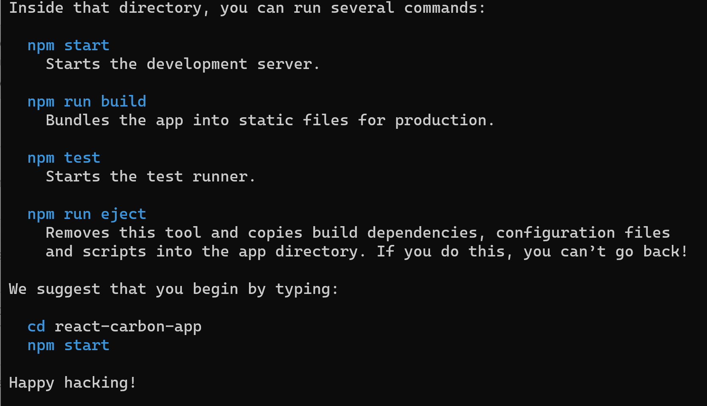
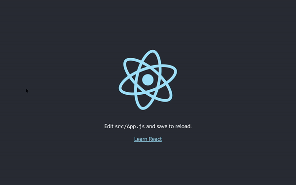
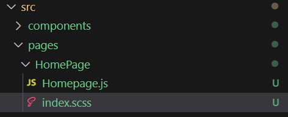

# How to create a React Application with Carbon in IBM Cloud

Hello everyone, in this blog post we are going to explain step by step how to create a simple web application in React with Carbon Design to Deploy in IBM Cloud.

## Step 1 — Install Node.js
To follow along with this tutorial, you will need to have Node.js and npm installed on your machine.

 Install **NodeJS** from the official [site](https://nodejs.org/en/).
 


## Step 2 Check Installation

You can check if you have them by running the following commands in your terminal:
```
node --version
```
in my case will be

```
v20.11.0
```

and the same for npm

```
npm --version
```

```
10.2.4
```

## Step 3 — Create React App

Let us creates a new React application called "react-carbon-app" using the create-react-app package. The "npx" command is used to execute the create-react-app package without the need to install it globally.

```
npx create-react-app react-carbon-app
```

This will allow you to use the create-react-app command to generate a new React.js project.

Here we are not using , `npm install -g create-react-app` because is used to globally install the create-react-app package on your system.


```
cd react-carbon-app
```

## Step 4 — Install Carbon Design Library
We install the Carbon Design Library into App

```
npm install @carbon/react@1.33.0
npm install sass@1.63.6
```

Adding Navigation & Icons
We can also add navigation and icons.

```
npm install @carbon/icons-react
npm install @carbon/themes @carbon/type
```
Redux is a library for managing states. 
```
npm install redux@4.2.1
npm install redux-persist@6.0.0
npm install react-redux@8.0.5
npm install localforage@1.10.0
npm install @reduxjs/toolkit

```
The react-dom-router provides an easy way to create user navigation between pages. Install it as follows:
```
npm install react-router-dom@6.8.1
```
## Step 5 — Start Developing App

```
npm start
```
at the localhost website 
[http://localhost:3000/](http://localhost:3000/)
you will get:




## Step 6 - Work with Carbon Design 


Open App.js under the src folder.

Lets take a look,
```js
import logo from './logo.svg';
import './App.css';

function App() {
  return (
    <div className="App">
      <header className="App-header">
        
        <p>
          Edit <code>src/App.js</code> and save to reload.
        </p>
        <a
          className="App-link"
          href="https://reactjs.org"
          target="_blank"
          rel="noopener noreferrer"
        >
          Learn React
        </a>
      </header>
    </div>
  );
}

export default App;

```
 
 Now we will try using some of the components available in the Carbon React library.
 Let us create a new application with three pages , the Homepage, the Profile page and a Upload Pag and one component of navigation.  Replace the previous App.js with this code:

```js
import React from "react";
import {
  Content,
  Header,
  HeaderName,
} from "@carbon/react";
import { Theme } from "@carbon/react";
import "./app.scss";
import Homepage from "./pages/HomePage/Homepage";
import ProfilePage from "./pages/ProfilePage/ProfilePage";
import UploadsPage from "./pages/UploadsPage/UploadsPage";
import Navigation from "./components/navigation/Navigation";
import { Provider, useSelector } from "react-redux";
import { store } from "./store/Store";
import { PersistGate } from "redux-persist/integration/react";
import { BrowserRouter, Route, Routes, Navigate } from "react-router-dom";

function App() {
  return (
    <BrowserRouter>
      <Provider store={store}>
        <Content>
          <Theme theme="g100">
            <Header aria-label="Header for Our Skeleton App">
              <HeaderName
                href="https://react.carbondesignsystem.com/"
                prefix="Carbon Design System"
              >
                Header for Our Skeleton App
              </HeaderName>
            </Header>
          </Theme>
          <Navigation />
          <Theme theme="g10">
            <Routes>
              <Route exact path="/" element={<Navigate to="/homepage" />} />

              <Route path="/homepage" element={<Homepage />} />

              <Route path="/upload" element={<UploadsPage />} />

              <Route path="/profile" element={<ProfilePage />} />
            </Routes>
          </Theme>
        </Content>
      </Provider>
    </BrowserRouter>
  );
}

export default App;
```
This code defines the main structure and routing for a React web application using the Carbon Design System. It imports necessary components, styles, and libraries, and sets up the routes for the Homepage, ProfilePage, and UploadsPage. The app uses a combination of Carbon Design components (Header, Content, and Theme) and React Router (BrowserRouter, Route, Routes, and Navigate) for navigation. Additionally, it incorporates Redux for state management and integrates Redux Persist for persisting the state in local storage. The main App function returns the JSX structure of the application, with the Provider component wrapping the content to make the Redux store available to the app.

Create a new file in the same folder called `app.scss` and we paste with the following code

```js
@use "@carbon/react";

```
The `app.scss` file is a Sass (Syntactically Awesome Style Sheets) file that imports the styles from the Carbon Design System's React package by using the `@use` directive. By importing the `@carbon/react` styles in `app.scss`, the application gains access to the global styles, component styles, and utility classes provided by the Carbon Design System. This ensures a consistent look and feel for the application, leveraging the pre-built styles and design patterns from the Carbon Design System.
## Step 7 - Redux for State Management

Create a new folder called store in the root of the project and then create new file called `Store.js`:


```js
import { configureStore } from "@reduxjs/toolkit";
import myObjectReducer from "./myObjectReducer";
import anotherObjectReducer from "./anotherObjectReducer";

export const store =  configureStore({
  reducer: {
    object1: myObjectReducer,
    object2: anotherObjectReducer,
  }
});
```


This code sets up a Redux store for a React application using the Redux Toolkit library. It imports two reducer functions, `myObjectReducer` and `anotherObjectReducer`, which are responsible for managing the state of two separate objects (object1 and object2) in the application. The `configureStore` function is used to create the store, and the imported reducers are combined into a single root reducer by passing them in an object as properties to the `reducer` key. Finally, the `store` is exported, making it available to be used by other parts of the application for state management.

We create in th same folder a new file called `myObjectReducer.js`
with the following code:

```js
import lodash from "lodash";
import { createSlice } from "@reduxjs/toolkit";

const initialState = {
  myObject: null,
};

const myObjectSlice = createSlice({
  name: "myObject",
  initialState,
  reducers: {
    setMyObject: (state, action) => {
      state.myObject = action.payload.myObject;
    },
    deleteMyObject: (state, action) => {
      state.myObject = null;
    }
  }
})

// Action creators are generated for each case reducer function
export const { setMyObject, deleteMyObject } = myObjectSlice.actions;
// Export reducer
export default myObjectSlice.reducer;

//Export selectors
const selectMyObject = (state) => {
  return state.object1.myObject;
};

export { selectMyObject};
```
This code defines a Redux slice for managing the state of `myObject` using the Redux Toolkit library. It imports the `lodash` library (though it's not used) and the `createSlice` function from Redux Toolkit. The initial state is set to an object with a `myObject` property that is initially null. The `createSlice` function creates a slice called `myObject` with two reducer functions: `setMyObject` and `deleteMyObject`. These reducers handle updating and deleting the `myObject` state, respectively. The slice's actions and reducer are exported, allowing them to be used elsewhere in the application. Additionally, a selector function `selectMyObject` is defined and exported, which is used to access the `myObject` property from the application state.

We create a new file called `anotherObjectReducer.js`

```js
import lodash from "lodash";
import { createSlice } from "@reduxjs/toolkit";


const initialState = {
  anotherObjectArr: []
};

const anotherObjectArrSlice = createSlice({
  name: "anotherObjectArr",
  initialState,
  reducers: {
    addAnotherObject: (state, action) => {
      state.anotherObjectArr = [
        ...state.anotherObjectArr, 
        action.payload.anotherObject
      ];
    }
  }
})

// Action creators are generated for each case reducer function
export const { addAnotherObject } = anotherObjectArrSlice.actions;
// Export reducer
export default anotherObjectArrSlice.reducer;

//Export selectors
const selectAnotherObjectArr = (state) => {
  return state.object2.anotherObjectArr;
};

export { selectAnotherObjectArr};
```

This code defines a Redux slice for managing the state of `anotherObjectArr` using the Redux Toolkit library. It imports the `lodash` library (though it's not used) and the `createSlice` function from Redux Toolkit. The initial state is set to an object with an `anotherObjectArr` property, which is an empty array. The `createSlice` function creates a slice called `anotherObjectArr` with one reducer function: `addAnotherObject`. This reducer handles adding new objects to the `anotherObjectArr` state. The slice's actions and reducer are exported, allowing them to be used elsewhere in the application. Additionally, a selector function `selectAnotherObjectArr` is defined and exported, which is used to access the `anotherObjectArr` property from the application state.
## Step 7 - Creation of pages and components

It is best to organize your components and pages in their individual folders. Create two folders called pages and components. And then create a HomePage folder under the pages folder. And then create a `Homepage.js` and a `index.scss` file in that folder.


```js
import React from "react";
import {
  Content,
  Button, Stack
} from "@carbon/react";
import "./index.scss";
import { Provider, useSelector, useDispatch } from "react-redux";
import { Store } from "../../store/Store";
import { addAnotherObject, selectAnotherObjectArr, } from "../../store/anotherObjectReducer";

function Homepage() {
	//Enable user interaction with anotherObject
  const dispatch = useDispatch();
  const onClickButton = ()=>{
    dispatch(addAnotherObject({anotherObject:"Another object!"}));
  };

  // Retrieve anotherObject from Store
  const anotherObjectArr = useSelector((state) => selectAnotherObjectArr(state));

	return (
	  <Content>
	  		<Stack gap={6}>
		      <span>Content belongs here.</span>
		      <span className="helper-text helper-box">This font is the helper font</span>
		      <span>Another Object Arr: {JSON.stringify(anotherObjectArr)}</span>
		      <Button onClick={()=>{onClickButton()}} >
		        Add another object
		      </Button>
	      </Stack>
	  </Content>
  );  
};

export default Homepage;

```
The `Homepage.js` file defines a React functional component called `Homepage` that displays content using Carbon Design System components. It imports `Content`, `Button`, and `Stack` components, custom styles from `index.scss`, and Redux-related functions and objects for managing the state of `anotherObjectArr`.

Inside the `Homepage` component, the `dispatch` function is used to enable user interaction with the `anotherObject` state. The `onClickButton` function dispatches the `addAnotherObject` action with a new object when the button is clicked. The `anotherObjectArr` state is retrieved from the Redux store using the `useSelector` hook and the `selectAnotherObjectArr` selector.

The component returns JSX that renders content, such as text elements and a button. When the button is clicked, the `onClickButton` function is called, updating the state and rendering the updated `anotherObjectArr` on the page. The `Stack` component organizes the layout with a gap of 6 between elements.
and `index.scss`


```js
@use "@carbon/type";
@use "@carbon/colors";

.helper-text{
	@include type.type-style("helper-text-01");
}

.helper-box{
  background-color: colors.$gray-20;
}
```
The `index.scss` file is a Sass stylesheet that imports the Carbon Design System's typography and color packages. It defines two custom CSS classes, `.helper-text` for typography and `.helper-box` for background color, using the predefined styles and variables from the Carbon Design System. These classes can be applied to elements in the React application to style them accordingly.

with the following structure



## Step 6 - Navigation

Create a new folder called Navigation in the components folder and then new file called `Navigation.js` at the path `components/navigation/Navigation.js`


```js
import {
  SideNav, SideNavItems, SideNavLink,
} from "@carbon/react";
import {
  User as User,
  Upload as Upload,
  Fork as Fork,
} from "@carbon/icons-react";

function Navigation() {
   return (<>
    <SideNav aria-label="Side navigation" isRail>
      <SideNavItems>
        <SideNavLink
          renderIcon={Upload}
          href="/upload">
            Upload
        </SideNavLink>
        <SideNavLink
          renderIcon={User}
          href="/profile">
            Profile
        </SideNavLink>
        <SideNavLink
          renderIcon={Fork}
          href="/homepage">
            Home
        </SideNavLink>
      </SideNavItems>
    </SideNav>;
  </>
  );
  
}

export default Navigation;

```
The `Navigation.js` file defines a React functional component called `Navigation` that creates a side navigation menu for the application using the Carbon Design System components. It imports `SideNav`, `SideNavItems`, and `SideNavLink` components for the navigation structure, and `User`, `Upload`, and `Fork` icons from the `@carbon/icons-react` package for visual representation.

The component returns JSX that renders a `SideNav` with a `SideNavItems` container holding three `SideNavLink` elements. Each `SideNavLink` has an associated icon and a corresponding `href` attribute to navigate to the `/upload`, `/profile`, or `/homepage` routes when clicked. The `Navigation` component can be included in other parts of the application to provide a consistent navigation experience.


## Step 10 - Creation of the 


We can create additional pages as follows:
`react-carbon-app\src\pages\ProfilePage\ProfilePage.js`


```js
import React from "react";
import {
  Content,
} from "@carbon/react";

function ProfilePage() {
	
	return (	
	  <Content>
      <span>Profile page.</span>
	  </Content>
  );  
};

export default ProfilePage;
```
The `ProfilePage.js` file defines a simple React functional component called `ProfilePage`. This component uses the Carbon Design System's `Content` component to render a section of the application dedicated to the profile page. Inside the `Content` component, a single text element with the content "Profile page." is displayed. The `ProfilePage` component can be used within the application to show the profile page content when the corresponding route is navigated to by the user.
and`react-carbon-app\src\pages\UploadsPage\UploadsPage.js`


```js
import React from "react";
import {
  Content,
} from "@carbon/react";

function UploadsPage() {
	
	return (		
	  <Content>
      <span>Uploads page.</span>
	  </Content>
  );  
};

export default UploadsPage;
```
The `UploadsPage.js` file defines a simple React functional component called `UploadsPage`. This component uses the Carbon Design System's `Content` component to render a section of the application dedicated to the uploads page. Inside the `Content` component, a single text element with the content "Uploads page." is displayed. The `UploadsPage` component can be used within the application to show the uploads page content when the corresponding route is navigated to by the user.


Now the code should allow the user to navigate between the several pages in our application


```
npm start
```
at the localhost website 
[http://localhost:3000/](http://localhost:3000/)
you will get:


## Migraiton to Yarn (Optional)
Yarn gives many advantages over npm, you can install if your project require.
   ```
   npm install --global yarn
   ```
and finally with yarn
```
yarn version check
```

```
 yarn init -y
```
Next, you need to install the dependencies listed in your existing `package.json` file using yarn. Run the following command:

```
yarn install
```

Finally, you can start the React application using the following command:
```
   yarn start
```
This will start your React application, and you can verify that everything is working as expected.